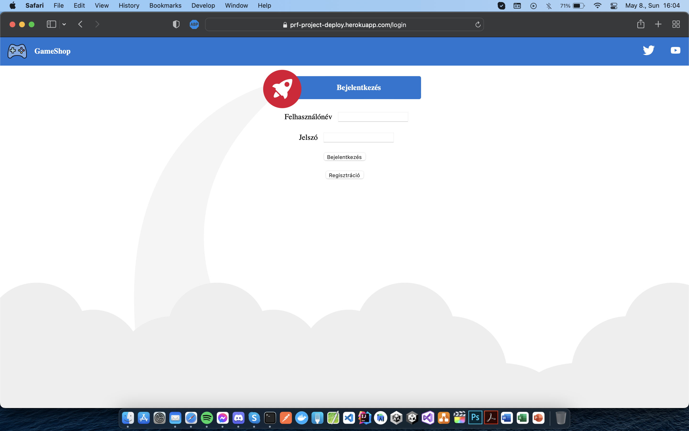
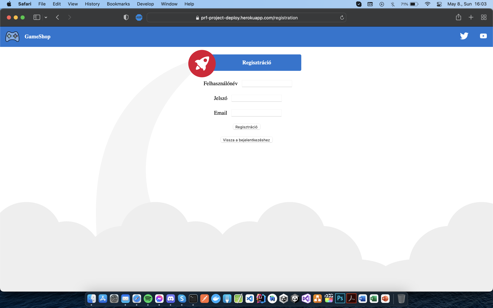
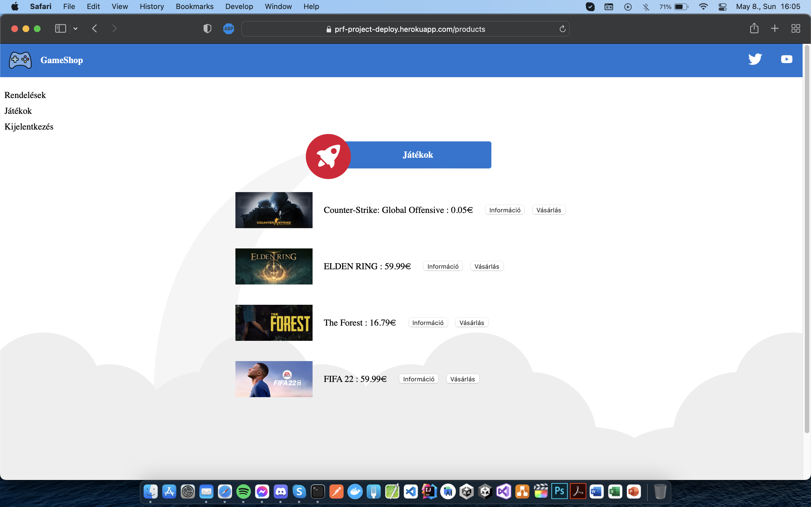
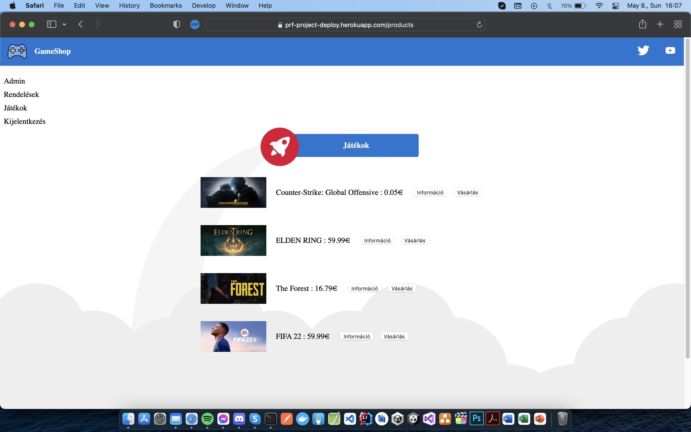
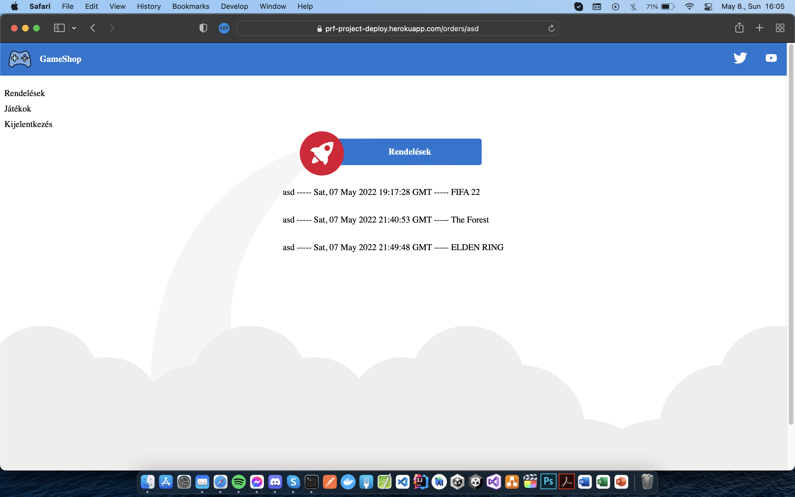
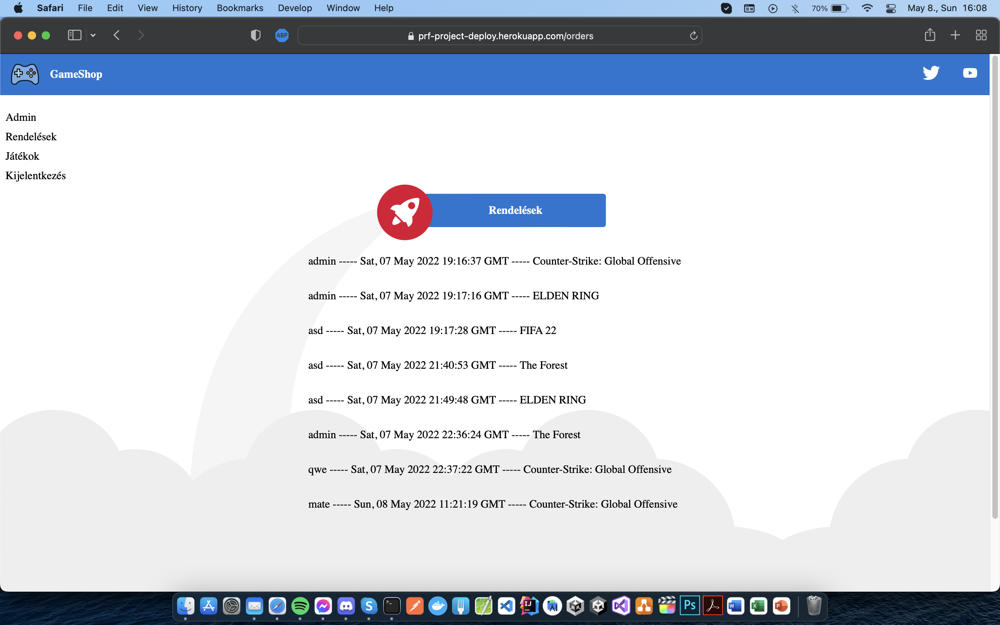
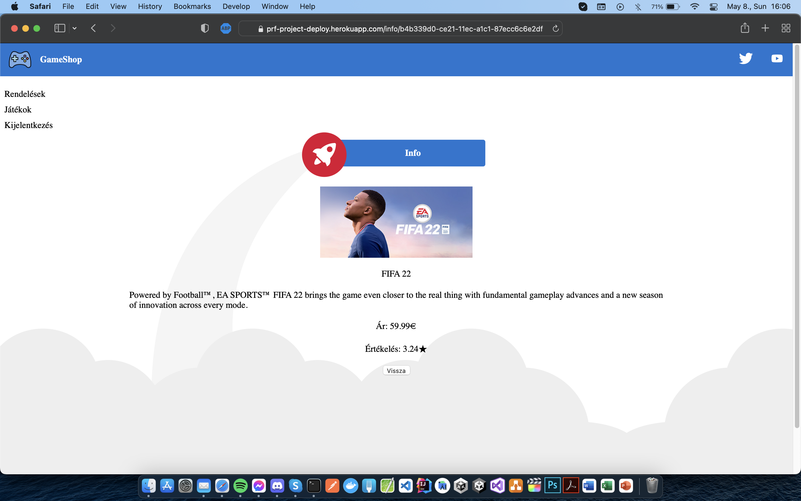
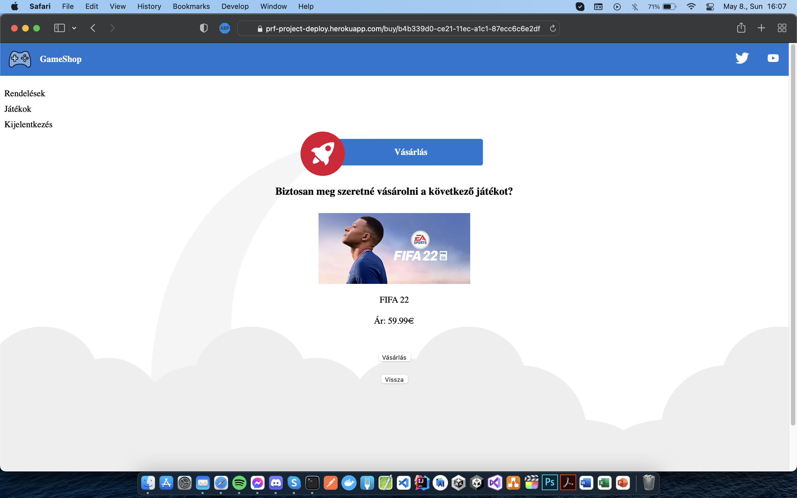
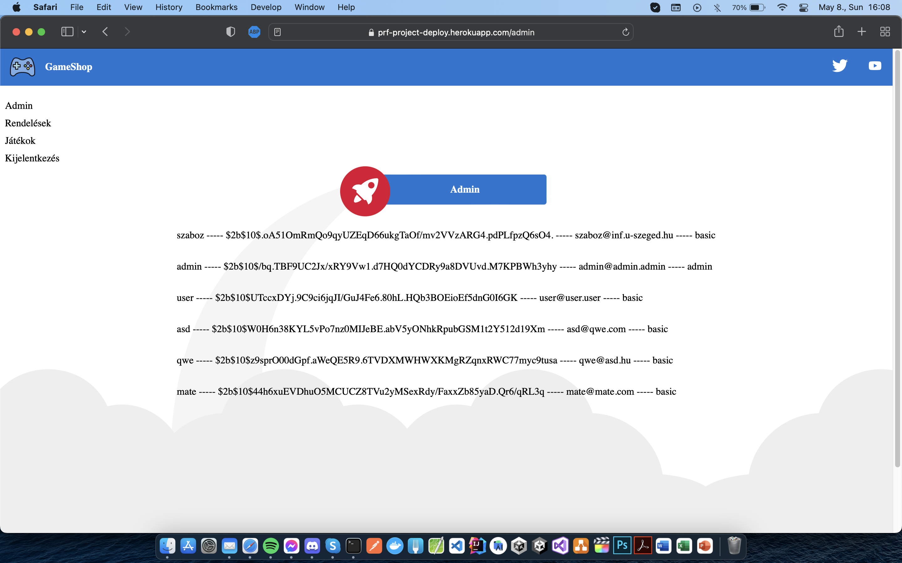

# Programrendszerek fejlesztése gyakorlat    Webshop projekt dokumentáció    Készítette: Vass Máté (GEVJ5W)

 

## Feladatleírás
Az általam választott feladat egy digitális játékokat árusító webáruház megalkotása volt. A felhasználók regisztráció és bejelentkezés után tudják használni a webshop-ot. Itt tekinthetik meg a különböző játékszoftvereket, melyekről bővebb információk is elérhetőek. Ezeket aztán természetesen kedvük szerint meg is vásárolhatják. A korábbi rendeléseiket kilistázhatják, majd a munka végeztével kijelentkezhetnek. Ha admin felhasználó jelentkezik be, ő az összes felhasználó által leadott korábbi rendelést láthatja, valamint minden regisztrált felhasználóról le is kérheti a legalapvetőbb információkat.

 

## Munkanapló

 

#### *2022.05.02. - 2022.05.04*
Mivel év közben nem tudtam a gyakorlatokon részt venni, ezért a projekt elkezdése előtt a tavalyi gyakorlati videókat néztem végig.

 

#### *2022.05.05.*
Csütörtökön a munkakörnyezet konfigurálása következett. Az órán elkészített kódrészleteket a saját gépemen is teszteltem, a kódsorokat alaposan áttanulmányoztam. Ezek után következhetett a projekt két fő részének, a backend-nek és a frontend-nek a beüzemelése.

A backend-hez kiindulásképp az órán is elkészített NodeJS + MongoDB programkódot vettem alapul. Egy online MongoDB adatbázis létrehozása után csupán az adatbázis elérési útvonalát kellett átírnom, és Postman-ből máris tudtam tesztelni a sikeres csatlakozást.

Az Angular-os frontend beüzemelése közbenn problémákba ütköztem. A különféle függőségek nem akartak egymással megfelelően működni, több óra próbálkozás után sem sikerült működésre bírnom a saját gépemen az órai kódot. Úgy döntöttem, egy teljesen új Angular projektet generálok, és ebbe fogok majd az órai anyagból átemelni kódrészleteket.

 

#### *2022.05.05.*
Pénteken az első dolgom a backend és a frontend összekapcsolása volt. Ekkor még a saját gépemen futtattam mindkettőt, így a CORS nem okozott problémát a tesztelésnél. Először kézileg vettem fel Postman-nel felhasználókat az adatbázisba, és a bejelentkezést igyekeztem tesztelni, közben folyamatosan olvasva a böngészőm fejlesztői konzolját. Miután megbizonyosodtam róla, hogy a kapcsolat létrejött az adatbázis, az ezt meghajtó szerver, és a felhasználói felület között, nekiláthattam a különféle alapvető funkciók megvalósítsának.

Egy egyszerű felhasználói felületre beviteli mezőket helyeztem el, és navigálást valósítottam meg a be- és kijelentkezés kezeléséhez, felhasználva az órái programkódokat. Ezek után a session kezelés és az AuthGuard bekötése következett, hogy csakis bejelentkezett felhasználók érhessék el a későbbiekben majd játékokat kilistázó oldalt. Ellenkező esetben a bejelentkezési oldalra navigáltatom őket vissza. Elkészítettem egy 404 Error oldalt is, ami olyan URL-ek esetén triggerelődik, melyek nem is léteznek.

Végül a regisztrációt is hassonló módon készítettem el. Itt figyeltem a hibakezelésre is, azaz létező felhasználónevet, valamint hibás formátumú email címet sem engedek meg az adatbázisba való felvétel esetén. Az aktuális hibáról természetesen a felhasználót is tájékoztatom hibaüzenet formájában.

 

#### *2022.05.06.*
Ezen a napon következhetett a további funkciók elkészítése. Előtte azonban kisebb hibajavításokat végeztem, valamint egy egyszerű oldalsó navigációs menüsort is elkészítettem a különböző komponensek közötti navigáláshoz. Ezen kívül egy accessLevel változót is felvettem a localStorage-ba, ezzel figyelve azt, hogy a bejelentkezett felhasználó admin, vagy pedig sima felhasználó.

Első körben az adatbázisban eltárolt elemeket sikerült kilistáznom a bejelentkezés után betöltődő komponensben. Ebbe rekordonként beletartoznak különböző egyszerű szöveges és számszerű adatok, valamint egy base64-ként eltárolt kép is.

Két újabb komponenst hoztam létre, melyekkel a lista elemeiről további információkat érhetünk el, valamint vásárolhatunk is. Itt a megfelelő elérési útvonalak, navigálások megvalósítása bizonyult a legnehezebb feladatnak, a kommunikáció során küldött JSON információk szépen működtek.

A korábbi rendelések kilistázása esetén admin felhasználó minden, az oldalon leadott rendelést lát, a sima felhasználók csak a sajátjaikat. Ezen kívül egy admin fület is készítettem, ezt természetesen az egyszerű felhasználók nem látják. Itt pedig az összes regisztrált felhasználóról érhetjük el a regisztrációkor megadott adatokat (a jelszavakat természetesen hash-elve).

 

#### *2022.05.07.*
A munkám utolsó napjára maradt az alkalmazás Heroku-ra való deploy-olása. A projekt készítése során ezzel gyűlt meg leginkább a bajom. Egy rövid internetes böngészés után a Heroku-s build-ek egyből működtek, a webszerver elindult, de a frontend nem akart betöltődni.

Végül a következőképpen sikerült megoldanom a problémát:
- elkészítettem egy Heroku-s applikációt
- a frontend serverUrl-jét átírtam a Heroku-s linkre
- build-eltem a frontendet, majd a backend mappájába másoltam az elkészült fájlokat
- az *package.json*-ben indítószkriptnek az *index.js*-t állítottam be
- az *index.js*-ben kisebb módosításokat végeztem, átírtam a portokat, és megoldottam az *index.html*-re való átirányítást is

Ezzel el is készült az alkalmazásom, ami a lent felsorolt formákban tekinthető meg.

Az alkalmazás localhost-on futtatható verziója az alábbi privát GitHub repository-ban érhető el (Collaborator-nak fel van véve a ZooLeeCoding nevű felhasználó):

https://github.com/material1999/prf_project/

Az alkalmazás az alábbi linken érhető el:

https://prf-project-deploy.herokuapp.com/

 

## Képernyőképek

 

1. képernyőkép - Bejelentkezés

 

2. képernyőkép - Regisztráció

 

3. képernyőkép - Termékek (egyszerű felhasználó)

 

4. képernyőkép - Termékek (admin felhasználó)

 

5. képernyőkép - Rendelések (egyszerű felhasználó)

 

6. képernyőkép - Rendelések (admin felhasználó)

 

7. képernyőkép - Játék információk

 

8. képernyőkép - Játék vásárlás

 

9. képernyőkép - Admin oldal

